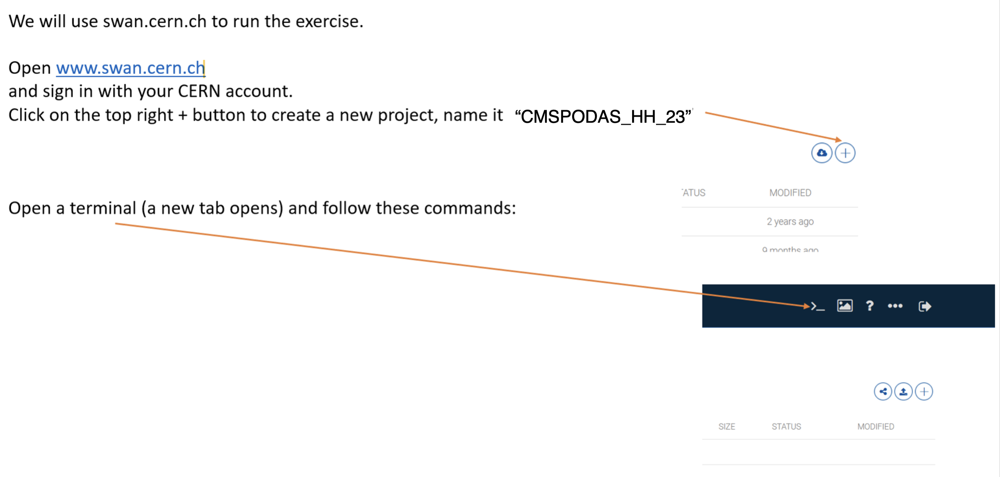

# CMSPODAS23
This repo is for the EGamma long exercise of the CMS Physics object & data analysis school [CMSPODAS2023](https://indico.desy.de/event/38207). 

Some references:
 - [CMSDAS CERN 2023](https://indico.cern.ch/event/1257234/)
 - [CMSDAS LPC 2023](https://twiki.cern.ch/twiki/bin/view/CMS/SWGuideCMSDataAnalysisSchoolLPC2023EGammaShortExercise)
 - [CMSDAS 2021](https://twiki.cern.ch/twiki/bin/view/CMS/SWGuideCMSDataAnalysisSchoolLPC2021EGammaExercise)
 - [LPC HATS 2020](https://twiki.cern.ch/twiki/bin/view/CMS/EGammaHATSatLPC2020)
 - [CMSDAS 2020](https://twiki.cern.ch/twiki/bin/view/CMS/SWGuideCMSDataAnalysisSchoolLPC2020EGammaExercise)

The exercise focuses on these following steps:

### Produce ntuples
Based on the [NANOAOD framework](https://github.com/cms-nanoAOD/nanoAOD-tools.git). CMSSW environment and packages should be set up firstly as follows: 

``cmsrel CMSSW_10_6_29`` 
``cd CMSSW_10_6_29/src`` 
``cmsenv`` 
``git clone https://github.com/cms-nanoAOD/nanoAOD-tools.git PhysicsTools/NanoAODTools`` 
``git clone https://github.com/AnYpku/CMSPODAS23.git`` 
``scram b`` 
``cd ntuples`` 

Ntuple tree contains electron branches could be produced by running: 
``python run_egamma_producer.py -f filename -y year`` 

### Swan setup 
We will use here https://swan.cern.ch for some exercises.
Please use software stack "102", maximum cores and maximum RAM, when selecting the environment.

Then run the commands below in the terminal:

>`cd SWAN_projects/CMSPODAS_HH_23/`

>`git clone https://github.com/AnYpku/CMSPODAS23.git`

Now, go back to SWAN tab, and open the "CMSPODAS23" folder.

### Energy calibration from ECAL
A brief introduction and exercise in ``reco_and_energy_corr/exercise-1.ipynb`` 

### Reconstruction
A detailed introduction in slides

### Energy regression and correction
Using the ntuple tree produced in the first step, we could draw some histograms to do comparisons and fitting. 
Some functions are prepared in the ``EGammaTools/`` and can call via: 

``root -l`` 
``gSystem->Load("libCMSPODAS23EgammaTools.so")`` 

Functions we may need and the usages are: 
1. Compare the prompt and nonprompt electron distributions:  ``hist = HistFuncs::compSigBkg(sigTree,bkgTree,nbins,low,high,"branchName","common selection","sig selection","bkg selection",normlization flag)`` 
2. Make histograms:  ``hist = HistFuncs::makeHist(tree,nbins,low,high,"branchName","selection")``
3. Fit functions containing ``makeDCBFit``, ``makeCBFit``, and ``makeCruijffFit`` could call via: 
``ResFitter fitter;`` ``fit = fitter.makeDCBFit(hist,0.5,1.5);`` ``fit.plot->Draw()`` (if necessary) 

Exercises in ``reco_and_energy_corr/exercise-2.ipynb`` and ``reco_and_energy_corr/exercise-2.md`` (run exercise-2.md in the root command line environment through terminal) 

### Identification
A brief introduction in slides and Jupyternotebook 
Exercises in ``egamma_id/exercise-3.ipynb`` 

### Tag& Probe method
A brief introduction in slides and Jupyternotebook 
Exercise in ``Tnp/exercise-4.ipynb`` 

### MVA ID training
A brief introduction in slides and Jupyternotebook 
Exercise in ``MVA/exercise-5.ipynb`` 
